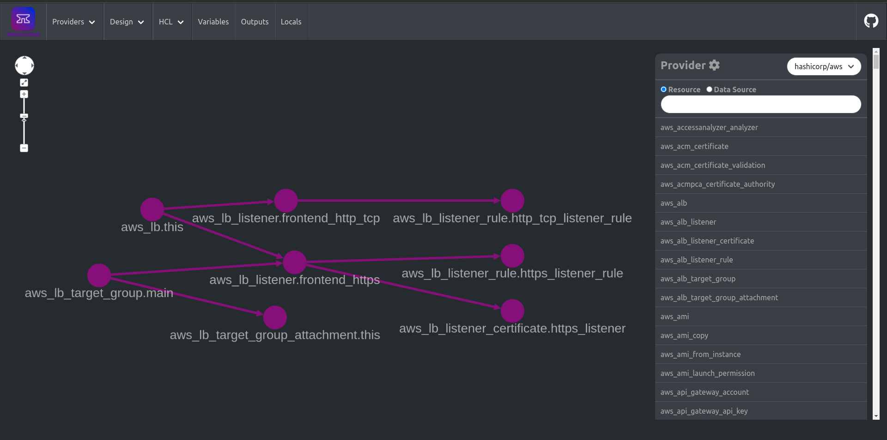
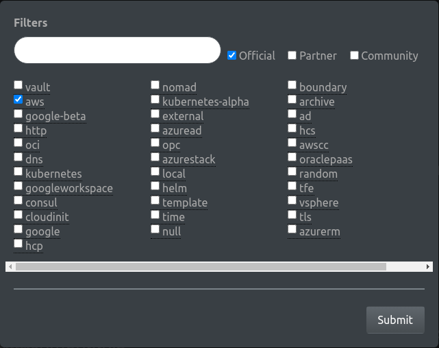
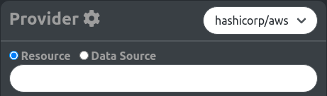
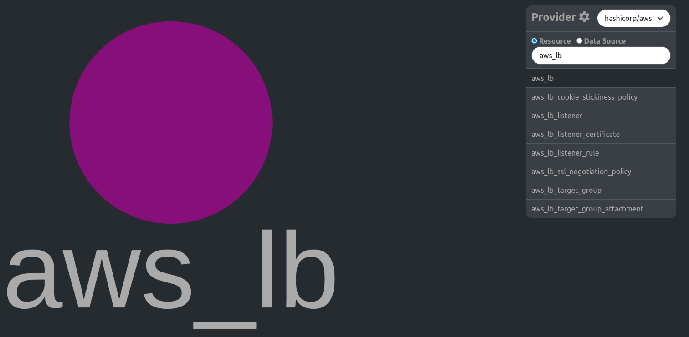
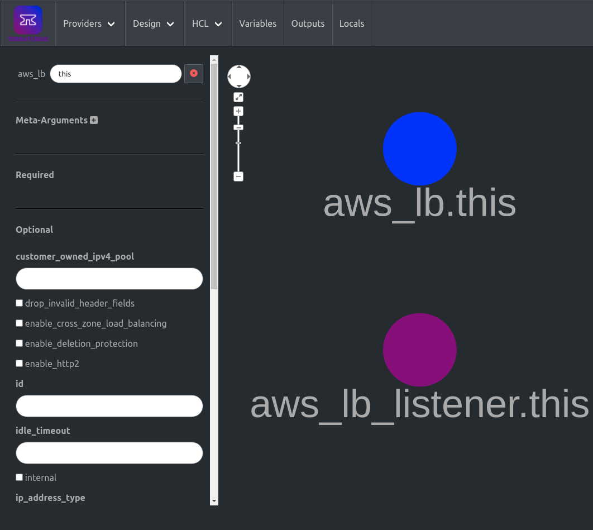
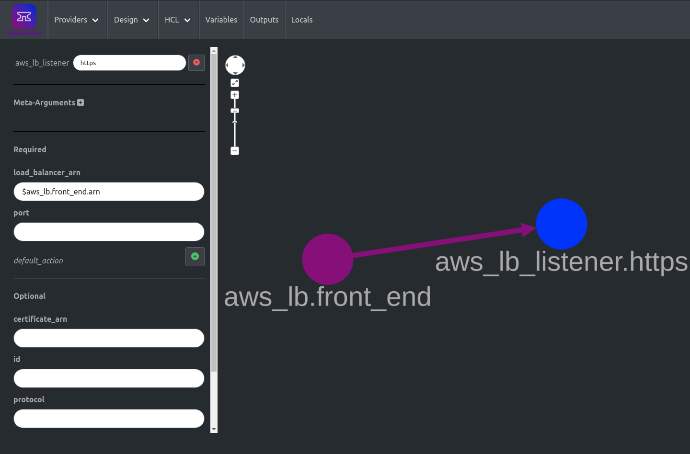
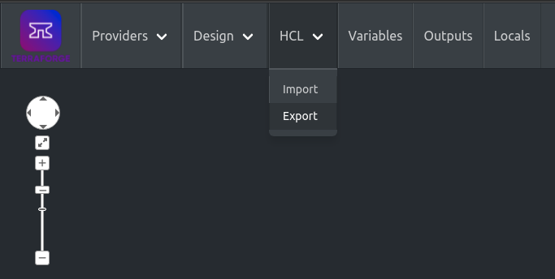

Terraforge is an application for generating Terraform code visually. Users select providers and then add resources as 
nodes to a graph that can be edited and arranged. Links between nodes appear automatically as the configuration of a
node makes references to other nodes. When finished the design can be exported as Terraform HCL. The configuration will
include all settings and configurations entered for the nodes.



## Background
Terraform is a tool for managing infrastructure and APIs in a codified manner utilizing a combination of a command-line
application, a series of vendor specific plugins, and a declarative configuration language written in HCL. The 
configuration uses a flat file structure with layers of abstraction attained through local and remote modules. Writing 
Terraform configurations create many complex relationships between resources since each resource may rely on attributes 
of others. 

The Terraform application generates a Directed Acyclic Graph (DAG) based on the configuration which establishes the 
correct order of resource manipulation. There are several tools that allow users to input configuration files then 
output and visualize the DAG. However, there seems to be a lack of any tool that can reverse this process, starting
with a visual representation of the desired infrastructure and exporting the Terraform code. This was the inspiration 
for Terraforge.

## Get started
### Running the App
Install the dependencies...

```bash
git clone https://github.com/badarsebard/terraforge.git
cd terraforge
npm install
```

...then start [Rollup](https://rollupjs.org):

```bash
npm run dev
```

Navigate to [localhost:5000](http://localhost:5000). You should see the app running.

### Using the App
To get started right away use the Wizard under the Providers menu. 
- Select the Official and AWS checkboxes in the modal and click Submit. 
- Select the `hashicorp/aws` provider from the dropdown on the right and choose either resource or data source radio buttons.  
- Double-click an entry to add a node of that type to the graph in the center of the page. 
- Click a node to open a pane on the left-hand side of the window where the name and attributes of the node can be 
modified. 
- References between nodes can be made by entering `$type.name.attributes` in the attribute; e.g.`$aws_lb.front_end.arn`. 
- After creating and editing some resources, export the Terraform configuration by using Export in the HCL menu. 
- The browser will download a file called `terraforge.tf` which will contain the Terraform configuration represented by the diagram and based on the configurations entered.
```terraform
resource "aws_lb" "front_end" {}
resource "aws_lb_listener" "https" {
  load_balancer_arn = aws_lb.front_end.arn
}
```

Please note that the app is unable to, at this time, execute any Terraform commands so the output is unformatted and unvalidated.

## Documentation
Learn about managing the available [providers](providers.md) and how resources and data sources are added.

See all the details about the [editor](editor.md) and its components.

Save and load work using [design](design.md) import and export.

Turn your graph into a [Terraform config](hcl.md) by exporting HCL or pick up with an existing project using the import feature.

See the [roadmap](roadmap.md) for a list of planned features.

# License
The majority of this project is licensed under the [Mozilla Public License, v. 2.0](https://mozilla.org/MPL/2.0/). The
`contrib/` directory and its contents are licensed under the [MIT](https://www.mit.edu/~amini/LICENSE.md) license. Any
file which does not contain the MPL license header is still covered by the MPL if it is located in a directory 
containing a `LICENSE` with the header.